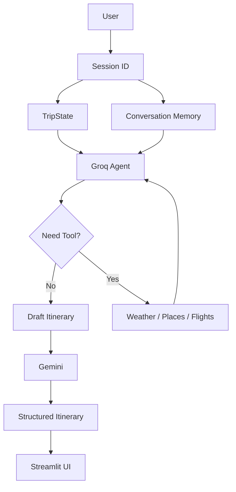

# Autonomous Travel Planner

This is an Agentic AI platform that automates your trip planning. It brings the long and tiring task of surfing through many websites whether for looking for places to stay, activities to do, cafes hotels, scenic points, weather conditions etc. to just one prompt.
It gives personalized responses based on the user's travel dates, destination, interests, and other provided preferences.

## Schemas

specifies the input and output formats for a structured data flow with LLMs and smooth data delivery

## Tools

- **`get_weather`:** Accumulates weather details using each day's temperature, precipitation chances into account. Uses free open-meteo api for fetching data
- **`get_places`:** Calls Google Places API (New) to fetch up to 10 places matching a city and user interests. Returns each place's name, address, rating, and price level when available.
- **`get_flights`:** Calls AeroDataBox API via Rapid API to get flights on a particular date from origin i.e. departure location to destination location. Returns flight details(flight no., airline, carrier, departure airport, arrival airpot, departure, arrival, status) for max upto 10 flights between origin and destination location. Doesnt include flight prices yet.

## Agent

`Problem Encountered -`

Agent has no memory i.e. no context of previous conversations

Another tradeoff upcoming with this, till now groq recieves: sys. propmt + tools results + user input; but if we include short term memory for context preservation it will receive: sys. prompt + tools results + history + trip state + user input. In other terms token usage would increase

Also, the system prompt needs to be shortened such that it doesnt use up token limits.

`Current Functioning -`

Agent has two memory's - one is TripState which contains all trip information like origin, destination, interests etc. while other is LangGraph's InMemorySaver for storing recent chat history. Currently we handle manually the size of in chat memory by keeping only last 12 mesages to reduce input tokens. TripState gets updated at each query if anything changed.

The user's query is first processed by Groq, which acts as the tool calling agent. Based on the current TripState and conversation context, it decides whether tools such as flights, weather, or places are required. Their results are incorporated into a draft itinerary, which is then passed to Gemini for structured itinerary generation.

`Architecture -`

`Future Improvements -`

- Long term memory integration. Storing using redis/vector DB the past session history
